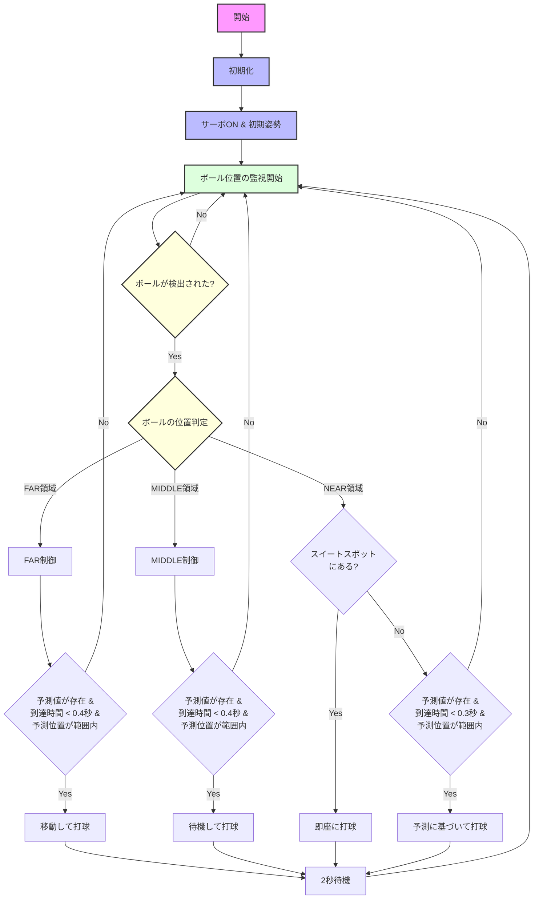

## HAIMOTOのアルゴリズム

### 基本的なプログラムの流れ

```mermaid
flowchart TD
    A[開始] --> B[初期化]
    B --> C[サーボON & 初期姿勢]
    C --> D[ボール位置の監視開始]
    D --> E{ボールが検出された?}
    E -->|No| D
    E -->|Yes| F{ボールの位置判定}
    
    F -->|FAR領域| G[FAR制御]
    G --> H{予測値が存在 & \n到達時間 < 0.4秒 & \n予測位置が範囲内}
    H -->|No| D
    H -->|Yes| I[移動して打球]
    I --> J[2秒待機]
    J --> D
    F -->|MIDDLE領域| K[MIDDLE制御]
    K --> L{予測値が存在 & \n到達時間 < 0.4秒 & \n予測位置が範囲内}
    L -->|No| D
    L -->|Yes| M[待機して打球]
    M --> J
    F -->|NEAR領域| N{スイートスポット\nにある?}
    N -->|Yes| O[即座に打球]
    N -->|No| P{予測値が存在 & \n到達時間 < 0.3秒 & \n予測位置が範囲内}
    P -->|Yes| Q[予測に基づいて打球]
    P -->|No| D
    O --> J
    Q --> J
    style A fill:#f9f,stroke:#333,stroke-width:2px
    style B fill:#bbf,stroke:#333,stroke-width:2px
    style C fill:#bbf,stroke:#333,stroke-width:2px
    style D fill:#dfd,stroke:#333,stroke-width:2px
    style E fill:#ffd,stroke:#333,stroke-width:2px
    style F fill:#ffd,stroke:#333,stroke-width:2px
```

### その他の機能
- 開始2分後と5分後にアラートを鳴らす．
- チョレイと叫ぶ．
- 変数が1秒以上同じ値の場合リセットする．